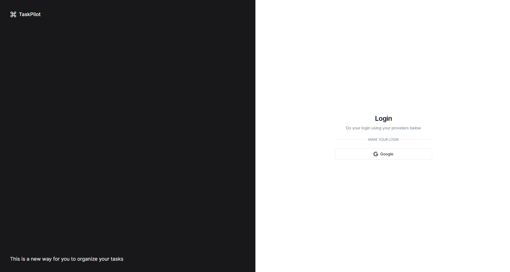
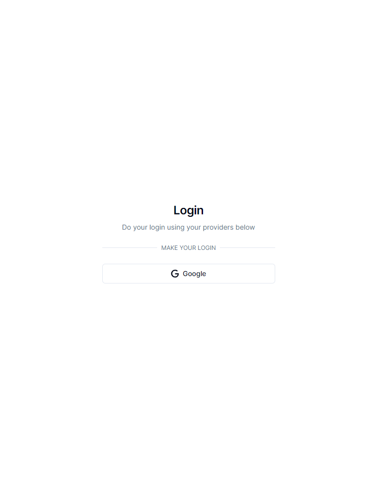
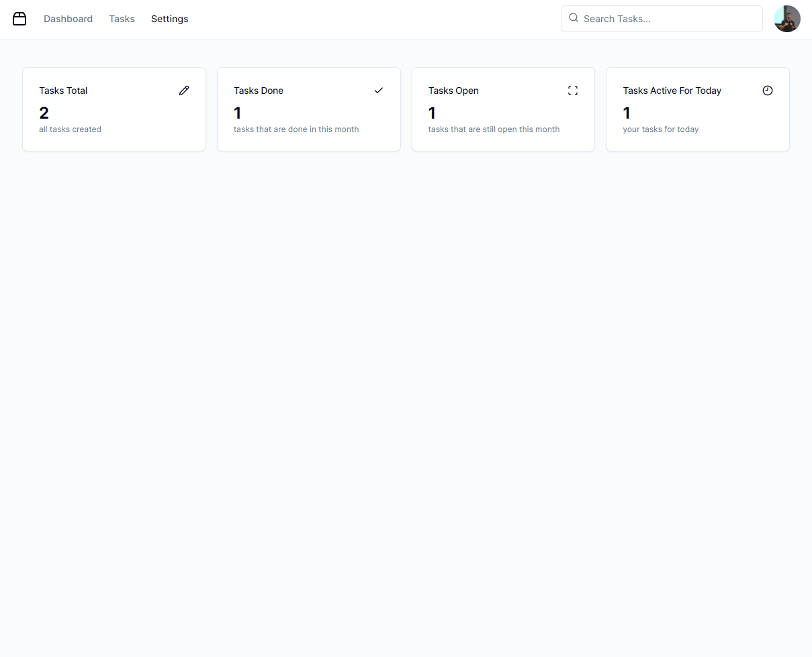
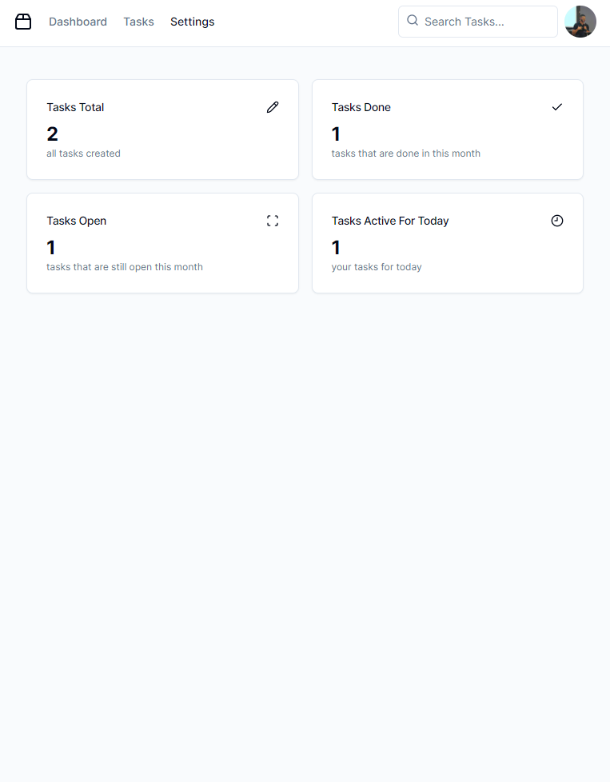
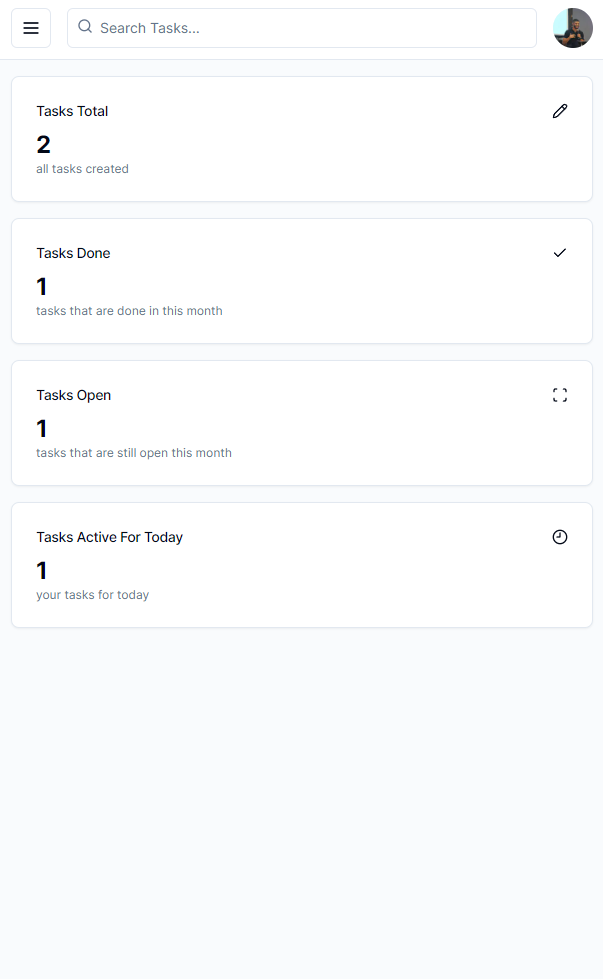
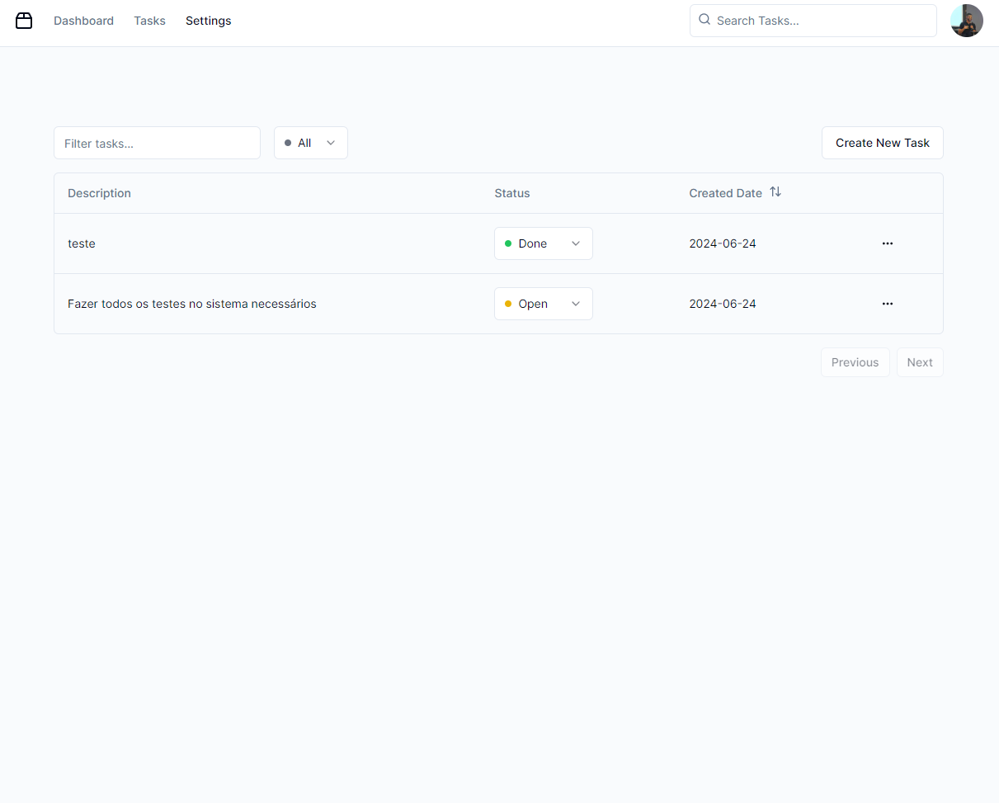
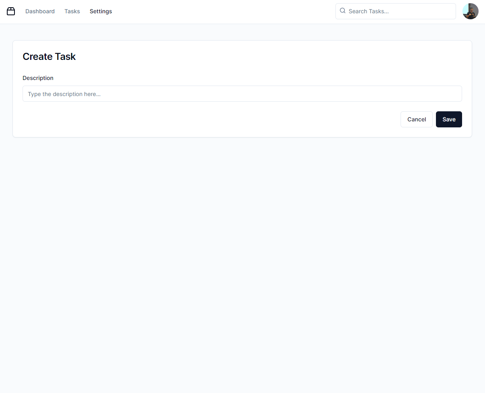
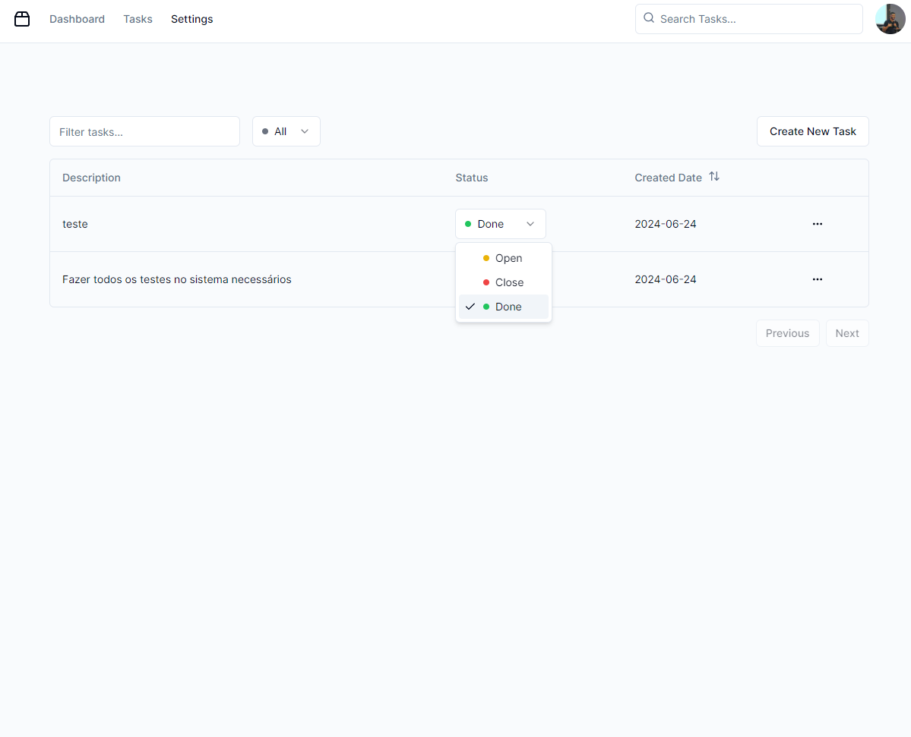

# TaskPilot

### 🔧Technologies

- Next.js (v14)
- Shadcn
- Docker
- Postgres Sql
- Prisma ORM

### 🎯MVP Features

- Authentication (Login with Google)
- Task Management
  - List all tasks from this user
  - Create/Update
  - Delete
  - Filtering
  - Sorting
- Dashboard
  - Total tasks created by user
  - Tasks Done on actual month
  - Tasks Open on actual month
  - Tasks Open and Active for Today

### ⏭️Future Version Ideas

- [ ] Basic Calendar
- [ ] Themes
- [ ] Additional Features for Task
  - [ ] Categories/tags
  - [ ] Comments and attachment
  - [ ] Due data and priority
- [ ] Subtasks inside the main task
- [ ] Notification
- [ ] Productive Analytics (graph and report about performance)

### Screenshots

#### Login

#### Dashboard

#### Tasks

